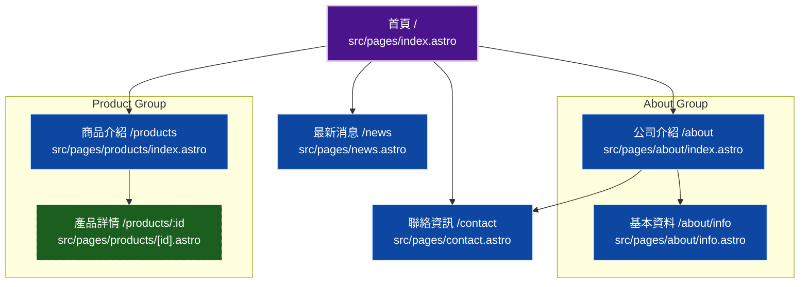

# Website Codemap - Chiaohsin

這份文檔描述了 [Chiaohsin](https://taisalee.github.io/chiaohsin/) 網站的頁面結構與其對應的程式碼檔案，並使用 Mermaid 圖表展示頁面間的導航關係。

## 頁面清單 (Code Map)

以下列出 `src/pages` 目錄下的主要頁面與其功能說明：

| URL 路徑 | 對應檔案 | 說明 |
| :--- | :--- | :--- |
| `/` | `src/pages/index.astro` | **首頁 (Home)**。 包含 Hero 區塊、關於我們摘要、產品分類預覽、品質保證以及呼籲行動 (CTA) 區塊。 |
| `/about` | `src/pages/about/index.astro` | **特色簡介 (About)**。 介紹公司的特色與核心價值。 |
| `/about/info` | `src/pages/about/info.astro` | **基本資料 (Company Info)**。 詳細的公司歷史、認證與規模等資訊。 |
| `/contact` | `src/pages/contact.astro` | **聯絡資訊 (Contact)**。 包含聯絡表單、地圖、電話與地址資訊。 |
| `/news` | `src/pages/news.astro` | **最新消息 (News)**。 列出公司的最新公告與新聞。 |
| `/products` | `src/pages/products/index.astro` | **商品介紹 (Products List)**。 展示所有產品分類與產品列表，支援分類篩選。 |
| `/products/[id]` | `src/pages/products/[id].astro` | **產品詳情 (Product Detail)**。 動態路由頁面，根據產品 ID 顯示特定產品的詳細規格與圖片。 |

## 網站架構圖 (Site Map Diagram)

下圖展示網站的導航結構與頁面間的連結關係。

## 資料來源 (Data Sources)
網站內容主要由以下 JSON 檔案驅動：
- `src/data/navigation.json`: 定義主選單與頁尾連結。
- `src/data/products.json`: 定義產品清單與詳細資訊。
- `src/data/categories.json`: 定義產品分類。
- `src/data/company.json`: 定義公司基本資訊 (名稱、電話、地址等)。
