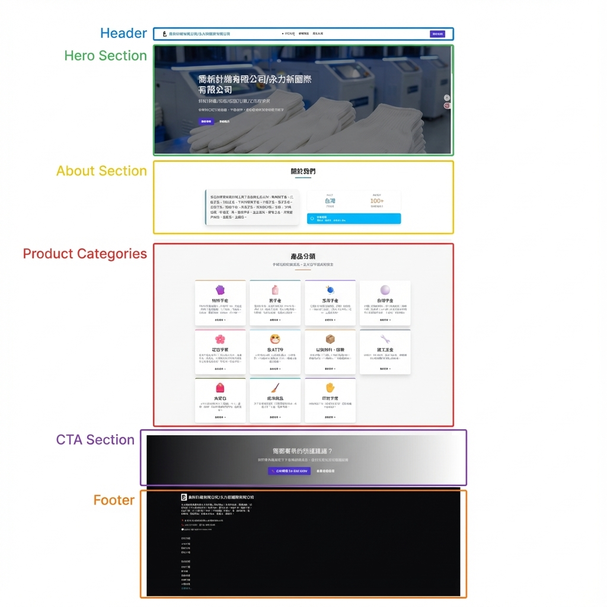

# Homepage Layout Analysis

這份文件分析了 [Chiaohsin](https://taisalee.github.io/chiaohsin/) 首頁的視覺區塊，並將其對應到程式碼中的具體組件。



## 區塊對應表

| 標籤 | 區塊名稱 | 對應檔案 | 程式碼位置 / 識別符 |
| :--- | :--- | :--- | :--- |
| **Header** | 導航列 | `src/layouts/Layout.astro` | 引入 `<Header />` 組件 |
| **Hero Section** | 首頁橫幅 | `src/pages/index.astro` | `<div class="hero ...">` |
| **About Section** | 關於我們 | `src/pages/index.astro` | `<section class="py-20 px-4 bg-base-100">` (包含 "關於我們" 標題) |
| **Product Categories** | 產品分類 | `src/pages/index.astro` | `<section class="py-20 px-4 bg-base-200">` (包含 "產品分類" 標題) |
| **CTA Section** | 呼籲行動 | `src/pages/index.astro` | `<section class="py-20 ...">` (包含 "需要專業的防護建議？") |
| **Footer** | 頁尾 | `src/layouts/Layout.astro` | 引入 `<Footer />` 組件 |

## 詳細程式碼結構

### 1. Header & Footer (Global Layout)
這兩個區塊定義在全域 Layout 中，因此會出現在所有頁面上。
- **檔案**: `src/layouts/Layout.astro`
- **內容**:
  ```astro
  <Header />
  <main ...>
    <slot /> <!-- 這裡插入各頁面內容 -->
  </main>
  <Footer />
  ```

### 2. 首頁內容 (Page Content)
中間的四個區塊 (Hero, About, Categories, CTA) 全部位於首頁檔案中，依序排列。
- **檔案**: `src/pages/index.astro`
- **結構**:
  ```astro
  <Layout ...>
    <!-- Hero Section -->
    <div class="hero ...">...</div>

    <!-- About Section -->
    <section>...</section>

    <!-- Categories Section -->
    <section>...</section>

    <!-- CTA Section -->
    <section>...</section>
  </Layout>
  ```
